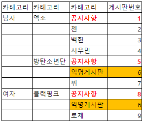

### 개발환경

- intellij
- Gradle 8.0
- JDK 17

### 추가

- 1번 문제는 별도로 JUnit 등의 테스트는 작성하지 않고 Main method 로 통합테스트만 진행하였습니다.
- 1번 문제에서 사용한 라이브러리는 아래와 같습니다.
    - org.json:json
- 2번 문제는 풀이만 진행하였습니다.

# 문제 해석

## 게시판 번호

> 공지사항은 이름은 같지만 각각 다른 ___게시판___ 이며 익명 게시판은 모두 같은 게시판이 각각 다른 카테고리에 소속되어 있다.

- 카테고리와 게시판의 의미를 모르겠습니다.
- 3번째 칼럼이 카테고리인지 게시판인지 혹은 4번째 칼럼이 게시판 번호가 카테고리 번호인지 모르겠습니다.
- 

### 3번째 칼럼이 게시판이라고 하였을 때, 카테고리 구조

※ 카테고리 이름 (카테고리 id)

- 남자 (1)
    - 엑소 (3)
    - 방탄소년단 (4)
- 여자 (2)
    - 블랭핑크 (5)

### 4번째 칼럼이 카테고리 번호라고 하였을 때, 카테고리 구조

※ 카테고리 이름 (카테고리 id)

- 남자 (1)
    - 엑소 (3)
        - _공지사항 (6)_
        - 첸 (7)
        - 백현 (8)
        - 시우민 (9)
    - 방탄소년단 (4)
        - _공지사항 (10)_
        - **익명게시판 (11)**
        - 뷔 (12)
- 여자 (2)
    - 블랭핑크 (5)
        - _공지사항 (13)_
        - **익명게시판 (11)**
        - 로제 (14)

### 결론

익명게시판과 공지사항의 예시를 강조하는 것으로 보아 2번째 방법으로 풀이.

## 다대다 관계형 구조

> 카테고리들간의 ___관계 데이터를 parent_idx, child_id 2개의 값으로만 저장___ 해야 하며 저장된 값을 임의의 자료구조를 통해 구조화 시켜서 위와 같은 관계 데이터를 얻을 수 있어야 한다.

- 계층 구조가 아닌 관계형 구조
- 다대다 관계형 구조로 Relation class 필요

제시된 요구조건에 따라 클래스를 선언하였습니다.

```java
class Category {
    int id;
    String name;
}

class CategoryRelation {
    int parent_idx;
    int child_id;
}
```

### 결론

Database 다대다 관계형 구조를 Application level에서 구현하기.

